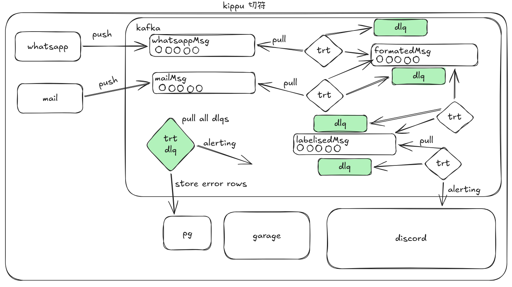

# kippu

Kippu (ticket in Japanese) is a streaming data pipeline that ingests messages from WhatsApp and email sources, processes them through Kafka consumers, enriches them with an LLM, and produces labeled support tickets stored in PostgreSQL. A React dashboard provides real-time monitoring.

## Architecture



## Quick start

Start the full stack (infrastructure + application services):

```bash
make up-all
```

Start the dashboard locally (requires `pnpm`):

```bash
pnpm build && pnpm run dev:dashboard
```

See [docs/getting-started.md](docs/getting-started.md) for detailed instructions.

## Tech stack

| Layer         | Technology                          |
|---------------|-------------------------------------|
| Messaging     | Apache Kafka (KRaft, 2 brokers)     |
| Object store  | Garage S3 (Kafka Tiered Storage)    |
| Database      | PostgreSQL 16                       |
| LLM           | Ollama (llama3.2:1b)                |
| Backend       | TypeScript, Node.js                 |
| Frontend      | React, TypeScript                   |
| Orchestration | Docker Compose                      |

## Documentation

- [Architecture](docs/architecture.md) -- pipeline, topics, services, DLQ system
- [Infrastructure](docs/infrastructure.md) -- Docker services, Kafka tiered storage, Garage S3
- [Getting started](docs/getting-started.md) -- prerequisites, launch commands, ports
