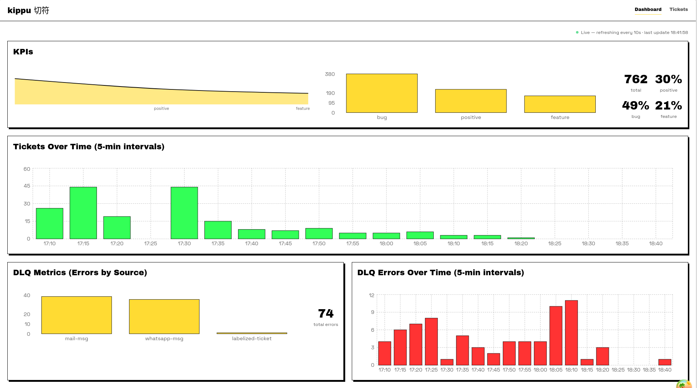
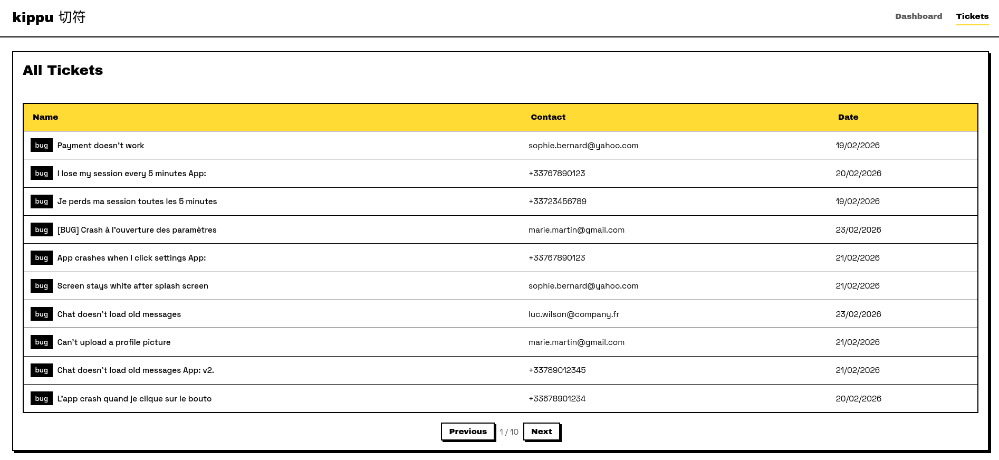
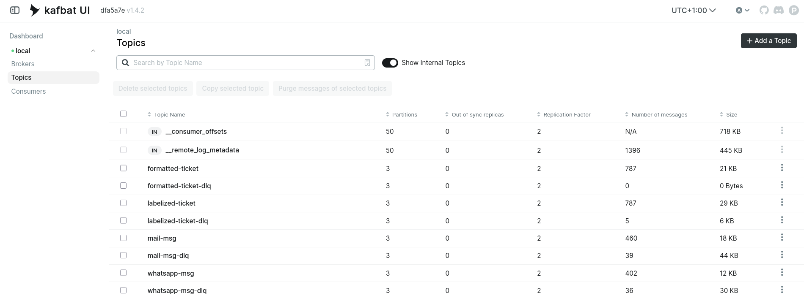
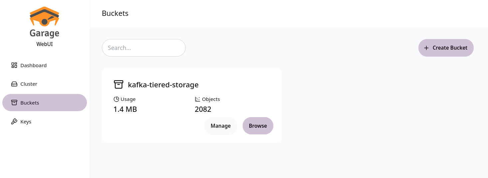

# UI and visualizations

## Dashboard -- KPI overview

The React dashboard displays real-time KPIs: ticket counts, error rates, and processing metrics.

## Dashboard -- Ticket table

Detailed view of labeled tickets with their source, category, and timestamps.

## Kafka UI

Kafka UI (port 8080) shows the 8 topics, their partitions, consumer groups, and message flow.

## Garage -- Tiered storage bucket

Garage Web UI (port 3909) displays the `kafka-tiered-storage` bucket where Kafka offloads old segments.
